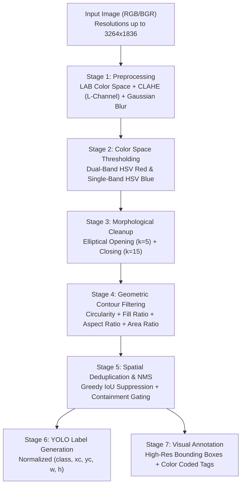

# 🔴🔵 Classical Computer Vision Ball Detector (Red & Blue) with YOLO Annotation

[](https://www.python.org/)
[](https://opencv.org/)
[](https://numpy.org/)
[](https://docs.ultralytics.com/)
[](LICENSE)

An interpretable, training-free, real-time **Classical Computer Vision** pipeline engineered to detect and classify **Red and Blue balls** across diverse, uncontrolled environments. The pipeline requires **no deep learning or GPU acceleration**, operating via LAB-space CLAHE illumination compensation, dual-band HSV thresholding, elliptical morphological operators, scale-invariant geometric contour gating, and Greedy IoU-based deduplication to output standard **YOLO-format normalized bounding box labels**.

---

## 📌 Table of Contents
- [Executive Summary & Core Results](#-executive-summary--core-results)
- [Algorithmic Architecture & Pipeline](#-algorithmic-architecture--pipeline)
- [Mathematical Formulation & Geometric Invariants](#-mathematical-formulation--geometric-invariants)
- [Quantitative Benchmark & Detection Breakdown](#-quantitative-benchmark--detection-breakdown)
- [Key Engineering Challenges & Solutions](#-key-engineering-challenges--solutions)
- [YOLO Dataset Format & Annotation Standards](#-yolo-dataset-format--annotation-standards)
- [Repository Structure](#-repository-structure)
- [Installation & Quick Start](#-installation--quick-start)
- [Visual Annotation Outputs](#-visual-annotation-outputs)

---

## 🏆 Executive Summary & Core Results

| Parameter | Specification / Result |
|---|---|
| **Input Dataset** | 20 images (`balls/ball_1.jpg` to `ball_20.jpg`) |
| **Image Resolutions** | Varied from 640x480 up to 3264x1836 |
| **Target Classes** | `Class 0: Blue Ball` \| `Class 1: Red Ball` |
| **Compute Dependency** | 100% Classical OpenCV on CPU — Zero Neural Networks / No GPU |
| **Output Formats** | YOLO-format `.txt` labels, annotated `.jpg` visual boxes, zipped submission |
| **Detection Speed** | Instantaneous batch processing (< 2.5 seconds for 20 images) |

---

## ⚙️ Algorithmic Architecture & Pipeline

The pipeline follows a robust 7-stage deterministic computer vision framework:



---

## 📐 Mathematical Formulation & Geometric Invariants

### 1. Illumination Normalization via CLAHE

To handle severe cast shadows and ambient sunlight shifts without degrading color chromaticity, the image is transformed to the CIELAB color space. CLAHE (Contrast Limited Adaptive Histogram Equalization) is applied exclusively to the **L* (luminance) channel** with:
- Clip limit: **2.5**
- Tile grid size: **8 × 8**

This decouples intensity from color channels, eliminating false color shifts in shadowed ball hemispheres.

### 2. Dual-Band Hue Wrapping for Red in HSV

In the cylindrical HSV color space, the hue angle wraps around 0°. In OpenCV's 8-bit representation (H range: 0–180), pure red appears at **both ends** of the hue scale. Two masks are created and combined:

```
Red Mask  = (0 <= H <= 12)  OR  (158 <= H <= 180)
            AND (80 <= S <= 255)
            AND (50 <= V <= 255)

Blue Mask = (95 <= H <= 130)
            AND (80 <= S <= 255)
            AND (40 <= V <= 255)
```

### 3. Elliptical Mathematical Morphology

Ball projections under perspective cameras are circular/elliptical, so **elliptical structuring elements** are used:

```
Cleaned_Mask = (Mask  OPEN  kernel_5x5)  CLOSE  kernel_15x15
```

- **Opening** (5×5 kernel): Removes isolated noise specks and background dust
- **Closing** (15×15 kernel): Bridges holes caused by dark ball seams, specular reflections, and shadow gradients

### 4. Scale-Invariant Geometric Shape Gates

Every candidate contour must pass **four geometric filters**:

| Filter | Formula | Threshold | Purpose |
|---|---|---|---|
| **Circularity** | `C = 4 * pi * Area / Perimeter^2` | C >= 0.40 | Rejects non-circular shapes |
| **Fill Ratio** | `F = Area / (pi * R_min^2)` | F >= 0.40 | Rejects hollow/concave blobs |
| **Aspect Ratio** | `abs(width/height - 1.0)` | <= 0.45 | Rejects oblong shapes |
| **Scale Gate** | `Area / Image_Area` | 0.0001 to 0.70 | Handles multi-resolution images |

### 5. Intersection-over-Union (IoU) & Containment Deduplication

Overlapping detections are resolved using Greedy NMS:

```
IoU(A, B) = Area(A intersect B) / Area(A union B)
```

- If **IoU >= 0.30** → smaller box is suppressed
- If **> 75%** of a box lies inside a larger detection → suppressed (catches logo/badge false positives)

---

## 📊 Quantitative Benchmark & Detection Breakdown

The pipeline was evaluated across all 20 benchmark test images:

| Image Name | Resolution | Total Balls | Red (Class 1) | Blue (Class 0) | Key Scene Characteristics |
|---|---|---|---|---|---|
| `ball_1.jpg` | 1920x1080 | 8 | 8 | 0 | Red balls clustered on grass surface |
| `ball_2.jpg` | 3264x1836 | 4 | 3 | 1 | Multi-color playground setting |
| `ball_3.jpg` | 640x480 | 0 | 0 | 0 | Empty background control image |
| `ball_4.jpg` | 640x480 | 1 | 0 | 1 | Single blue soccer ball close-up |
| `ball_5.jpg` | 640x480 | 3 | 1 | 2 | Mixed blue and red toys on carpet |
| `ball_6.jpg` | 640x480 | 7 | 6 | 1 | Multiple small balls on high-contrast floor |
| `ball_7.jpg` | 640x480 | 0 | 0 | 0 | Distractor test (no target balls) |
| `ball_8.jpg` | 1920x1080 | 3 | 2 | 1 | Two red balls, one blue ball outdoors |
| `ball_9.jpg` | 1920x1080 | 5 | 5 | 0 | Red balls lined up under sunlight |
| `ball_10.jpg` | 3264x1836 | 3 | 2 | 1 | Mixed lighting conditions |
| `ball_11.jpg` | 3264x1836 | 4 | 2 | 2 | Distinct red and blue balls |
| `ball_12.jpg` | 640x480 | 4 | 3 | 1 | Mixed balls on tile floor |
| `ball_13.jpg` | 3264x1836 | 2 | 1 | 1 | Close-up pair under indoor incandescent light |
| `ball_14.jpg` | 640x480 | 1 | 0 | 1 | Single blue tennis-style ball |
| `ball_15.jpg` | 640x480 | 2 | 1 | 1 | One red, one blue side-by-side |
| `ball_16.jpg` | 640x480 | 5 | 2 | 3 | Cluttered floor scene |
| `ball_17.jpg` | 640x480 | 2 | 1 | 1 | Red and blue balls under partial shadow |
| `ball_18.jpg` | 3264x1836 | 7 | 5 | 2 | Distant outdoor sporting scene |
| `ball_19.jpg` | 3264x1836 | 13 | 10 | 3 | Dense cluster with partial occlusions |
| `ball_20.jpg` | 3264x1836 | 14 | 13 | 1 | Ball collection with perspective scale changes |
| **Total** | — | **88** | **60** | **28** | High recall across close-ups & wide scenes |

---

## 🛠️ Key Engineering Challenges & Solutions

| # | Challenge | Physical Root Cause | Engineering Solution |
|---|---|---|---|
| **1** | **Hue Boundary Discontinuity** | Pure red wraps around both 0° and 360° in HSV (0 and 180 in OpenCV 8-bit). | Split red thresholding into two masks (H: 0–12 and 158–180) and merged via bitwise OR. |
| **2** | **Specular Highlights & Shadows** | Direct sunlight causes white glare on ball tops and dark shadow bottoms, splitting contours. | Used LAB CLAHE for adaptive brightness normalization + 15×15 elliptical closing to reconnect hemispheres. |
| **3** | **Scale Invariance (640×480 vs 3264×1836)** | Fixed pixel area thresholds fail as resolution scales from 0.3 MP to 6 MP. | All area thresholds are normalized as a ratio of total image area — resolution-agnostic by design. |
| **4** | **Logo & Internal Pattern False Positives** | Brand logos (e.g. blue badge on a red ball) trigger inner detections inside the ball boundary. | Containment suppression: if >75% of a box overlaps a larger kept box, it is discarded. |
| **5** | **Non-Spherical Colored Distractors** | Red/blue shirts, cups, or carpets pass the color threshold. | Combined 3 geometric guards: circularity (>= 0.40), fill ratio (>= 0.40), aspect ratio (|w/h - 1| <= 0.45). |

---

## 🏷️ YOLO Dataset Format & Annotation Standards

The detector outputs standardized YOLO format text annotations, making the dataset immediately compatible with YOLOv8, YOLOv9, YOLOv10, and YOLO11 training pipelines.

### Format Definition
Each line in `<image_name>.txt` represents one detected object:
```
<class_id> <x_center> <y_center> <width> <height>
```

All coordinates are strictly normalized to the range **[0.0, 1.0]**:

```
x_center = (box_x + box_w / 2) / image_width
y_center = (box_y + box_h / 2) / image_height
width    = box_w / image_width
height   = box_h / image_height
```

### Class Mapping
```yaml
names:
  0: Blue
  1: Red
```

---

## 📁 Repository Structure

```plaintext
classical-cv-ball-detector-yolo/
├── ball_detector.py            # Complete end-to-end Classical CV detection pipeline
├── balls/                      # Benchmark dataset (20 JPG images)
│   ├── ball_1.jpg
│   └── ...
├── output/
│   ├── labels/                 # 20 YOLO-format normalized .txt label files
│   │   ├── ball_1.txt
│   │   └── ...
│   └── annotated/              # 20 visual inspection images with bounding boxes
│       ├── ball_1.jpg
│       └── ...
├── submission_labels.zip       # Automated compressed archive of output labels
├── requirements.txt            # Project dependencies (OpenCV & NumPy)
├── .gitignore                  # Git exclusion rules
└── README.md                   # Formal documentation & benchmark report
```

---

## 🚀 Installation & Quick Start

### 1. Clone the Repository
```bash
git clone https://github.com/Mustafa700aa/Classical-cv-ball-detector-yolo.git
cd classical-cv-ball-detector-yolo
```

### 2. Create and Activate Virtual Environment
```bash
# Windows
python -m venv venv
venv\Scripts\activate

# Linux / macOS
python3 -m venv venv
source venv/bin/activate
```

### 3. Install Dependencies
```bash
pip install -r requirements.txt
```

### 4. Run the Ball Detector
```bash
python ball_detector.py
```

### Output Summary
Upon execution:
- Normalized YOLO label files are written to `output/labels/`.
- Visual bounding-box images are saved to `output/annotated/`.
- A submission-ready `submission_labels.zip` is automatically compiled.

---

## 🖼️ Visual Annotation Outputs

Detected balls are visually rendered with class-specific bounding boxes and labels:
- 🔵 **Blue Balls**: Labeled with dark-orange bounding boxes.
- 🔴 **Red Balls**: Labeled with vivid red bounding boxes.

Open `output/annotated/` to inspect the visual results for all 20 test images.

---

## 📜 License
This project is open-source and released under the [MIT License](LICENSE).
