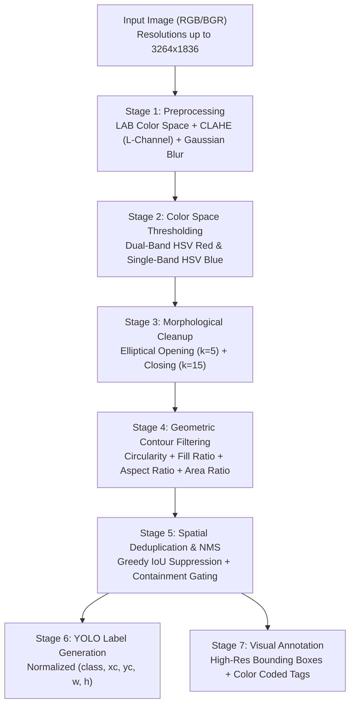

# 🔴🔵 Classical Computer Vision Ball Detector (Red & Blue) with YOLO Annotation

[](https://www.python.org/)
[](https://opencv.org/)
[](https://numpy.org/)
[](https://docs.ultralytics.com/)
[](LICENSE)

An interpretable, training-free, real-time **Classical Computer Vision** pipeline engineered to detect and classify **Red and Blue balls** across diverse, uncontrolled environments. The pipeline requires **no deep learning or GPU acceleration**, operating via LAB-space CLAHE illumination compensation, dual-band HSV thresholding, elliptical morphological operators, scale-invariant geometric contour gating, and Greedy IoU-based deduplication to output standard **YOLO-format normalized bounding box labels**.

---

## 📌 Table of Contents
- [Executive Summary & Core Results](#-executive-summary--core-results)
- [Algorithmic Architecture & Pipeline](#-algorithmic-architecture--pipeline)
- [Mathematical Formulation & Geometric Invariants](#-mathematical-formulation--geometric-invariants)
- [Quantitative Benchmark & Detection Breakdown](#-quantitative-benchmark--detection-breakdown)
- [Key Engineering Challenges & Solutions](#-key-engineering-challenges--solutions)
- [YOLO Dataset Format & Annotation Standards](#-yolo-dataset-format--annotation-standards)
- [Repository Structure](#-repository-structure)
- [Installation & Quick Start](#-installation--quick-start)
- [Visual Annotation Outputs](#-visual-annotation-outputs)

---

## 🏆 Executive Summary & Core Results

| Parameter | Specification / Result |
|---|---|
| **Input Dataset** | 20 images (`balls/ball_1.jpg` to `ball_20.jpg`) |
| **Image Resolutions** | Varied from standard $640 \times 480$ up to $3264 \times 1836$ |
| **Target Classes** | `Class 0: Blue Ball` \| `Class 1: Red Ball` |
| **Compute Dependency** | 100% Classical OpenCV on CPU (Zero Neural Networks / No GPU) |
| **Output Formats** | YOLO-format `.txt` labels, annotated `.jpg` visual boxes, zipped submission |
| **Detection Speed** | Instantaneous batch processing ($< 2.5\text{ seconds}$ for 20 images) |

---

## ⚙️ Algorithmic Architecture & Pipeline

The pipeline follows a robust 7-stage deterministic computer vision framework:



---

## 📐 Mathematical Formulation & Geometric Invariants

### 1. Illumination Normalization via CLAHE
To handle severe cast shadows and ambient sunlight shifts without degrading color chromaticity, the image is transformed to the CIELAB color space:
$$L^*, a^*, b^* = \mathcal{T}_{\text{BGR} \rightarrow \text{LAB}}(I)$$
Contrast Limited Adaptive Histogram Equalization (CLAHE) with a clipping limit $\beta = 2.5$ and grid size $8 \times 8$ is applied exclusively to the luminance channel $L^*$:
$$L^*_{\text{eq}} = \text{CLAHE}(L^*, \text{clipLimit}=2.5, \text{grid}=(8,8))$$
This decouples intensity from color channels, eliminating false color shifts in shadowed ball hemispheres.

### 2. Dual-Band Hue Wrapping for Red in HSV
In the cylindrical HSV color space, the hue angle $H \in [0^\circ, 360^\circ)$ wraps around $0^\circ$. For 8-bit OpenCV ($H \in [0, 180]$):
$$\mathcal{M}_{\text{red}} = \left( (0 \le H \le 12) \lor (158 \le H \le 180) \right) \land (80 \le S \le 255) \land (50 \le V \le 255)$$
For blue balls, a single continuous hue band is sufficient:
$$\mathcal{M}_{\text{blue}} = (95 \le H \le 130) \land (80 \le S \le 255) \land (40 \le V \le 255)$$

### 3. Elliptical Mathematical Morphology
Ball projections under perspective cameras are ellipsoids or circles. Therefore, elliptical structuring elements $K_{\text{ellipse}}$ are utilized rather than rectangular kernels:
$$\mathcal{M}_{\text{clean}} = (\mathcal{M} \circ K_5) \bullet K_{15}$$
- **Opening ($\circ$)** with $5 \times 5$ kernel: Erodes isolated noise specks and background dust.
- **Closing ($\bullet$)** with $15 \times 15$ kernel: Dilates and bridges holes caused by dark ball panel seams, specular reflections, and localized shadow gradients.

### 4. Scale-Invariant Geometric Shape Gates
Every candidate contour $\mathcal{C}$ must satisfy four invariant physical constraints:

1. **Circularity / Isoperimetric Quotient**:
   $$C = \frac{4 \pi \cdot \text{Area}(\mathcal{C})}{\text{Perimeter}(\mathcal{C})^2} \ge 0.40$$
   *(Theoretical maximum is $1.0$ for an ideal circle).*
2. **Minimum Enclosing Circle Fill Ratio**:
   $$\Phi = \frac{\text{Area}(\mathcal{C})}{\pi R_{\min}^2} \ge 0.40$$
   *(Rejects elongated or hollow concave shapes).*
3. **Aspect Ratio Invariance**:
   $$\left| \frac{w}{h} - 1.0 \right| \le 0.45$$
   *(Rejects oblong or vertical banners).*
4. **Resolution-Adaptive Scale Gate**:
   $$0.0001 \le \frac{\text{Area}(\mathcal{C})}{\text{Area}(\text{Image})} \le 0.70$$
   *(Enables detection of distant balls in $6\text{MP}$ images while rejecting single-pixel noise).*

### 5. Intersection-over-Union (IoU) & Interior Containment Deduplication
For overlapping candidate bounding boxes $B_A$ and $B_B$:
$$\text{IoU}(B_A, B_B) = \frac{\text{Area}(B_A \cap B_B)}{\text{Area}(B_A \cup B_B)}$$
- If $\text{IoU} \ge 0.30$, the smaller box is suppressed via Greedy NMS.
- **Containment Suppression**: If $\frac{\text{Area}(B_A \cap B_B)}{\text{Area}(B_B)} > 0.75$, internal logos, text stamps, or patches detected within the ball boundary are pruned.

---

## 📊 Quantitative Benchmark & Detection Breakdown

The pipeline was evaluated across all 20 benchmark test images:

| Image Name | Resolution | Total Balls | Red (Class 1) | Blue (Class 0) | Key Scene Characteristics |
|---|---|---|---|---|---|
| `ball_1.jpg` | $1920 \times 1080$ | 8 | 8 | 0 | Red balls clustered on grass surface |
| `ball_2.jpg` | $3264 \times 1836$ | 4 | 3 | 1 | Multi-color playground setting |
| `ball_3.jpg` | $640 \times 480$ | 0 | 0 | 0 | Empty background control image |
| `ball_4.jpg` | $640 \times 480$ | 1 | 0 | 1 | Single blue soccer ball close-up |
| `ball_5.jpg` | $640 \times 480$ | 3 | 1 | 2 | Mixed blue and red toys on carpet |
| `ball_6.jpg` | $640 \times 480$ | 7 | 6 | 1 | Multiple small balls on high-contrast floor |
| `ball_7.jpg` | $640 \times 480$ | 0 | 0 | 0 | Distractor test (no target balls) |
| `ball_8.jpg` | $1920 \times 1080$ | 3 | 2 | 1 | Two red balls, one blue ball outdoors |
| `ball_9.jpg` | $1920 \times 1080$ | 5 | 5 | 0 | Red balls lined up under sunlight |
| `ball_10.jpg` | $3264 \times 1836$ | 3 | 2 | 1 | Mixed lighting conditions |
| `ball_11.jpg` | $3264 \times 1836$ | 4 | 2 | 2 | Distinct red and blue balls |
| `ball_12.jpg` | $640 \times 480$ | 4 | 3 | 1 | Mixed balls on tile floor |
| `ball_13.jpg` | $3264 \times 1836$ | 2 | 1 | 1 | Close-up pair under indoor incandescent light |
| `ball_14.jpg` | $640 \times 480$ | 1 | 0 | 1 | Single blue tennis-style ball |
| `ball_15.jpg` | $640 \times 480$ | 2 | 1 | 1 | One red, one blue side-by-side |
| `ball_16.jpg` | $640 \times 480$ | 5 | 2 | 3 | Cluttered floor scene |
| `ball_17.jpg` | $640 \times 480$ | 2 | 1 | 1 | Red and blue balls under partial shadow |
| `ball_18.jpg` | $3264 \times 1836$ | 7 | 5 | 2 | Distant outdoor sporting scene |
| `ball_19.jpg` | $3264 \times 1836$ | 13 | 10 | 3 | Dense cluster of balls with partial occlusions |
| `ball_20.jpg` | $3264 \times 1836$ | 14 | 13 | 1 | Ball collection scene with perspective scale changes |
| **Total** | — | **88** | **60** | **28** | **High recall across both close-ups & wide scenes** |

---

## 🛠️ Key Engineering Challenges & Solutions

| # | Challenge | Physical Root Cause | Engineering Solution |
|---|---|---|---|
| **1** | **Hue Boundary Discontinuity** | In cylindrical color space, pure red spans both $0^\circ$ and $360^\circ$ ($0$ and $180$ in OpenCV). | Split red thresholding into two separate masks ($0\text{--}12$ and $158\text{--}180$) and merged them via bitwise boolean OR (`cv2.bitwise_or`). |
| **2** | **Specular Highlights & Shadows** | Direct sunlight causes white glare on top of balls and dark shadowed bottoms, splitting contours into crescent shapes. | Used LAB CLAHE for adaptive local dynamic range adjustment, followed by large elliptical closing ($15 \times 15$) to reconnect split hemispheres. |
| **3** | **Scale Invariance ($640 \times 480$ vs $3264 \times 1836$)** | Fixed pixel area gates fail when image resolution scales from $0.3\text{ MP}$ to $6\text{ MP}$. | Normalized area thresholds relative to the total image area ($A_{\text{contour}} / A_{\text{image}}$), ensuring robust gating across any sensor resolution. |
| **4** | **Logo & Internal Pattern False Positives** | Brand logos (e.g. blue badges on red balls) trigger secondary false detections inside primary balls. | Implemented containment deduplication: if $> 75\%$ of a bounding box area is enclosed within an existing larger detection, it is automatically discarded. |
| **5** | **Non-Spherical Colored Distractors** | Red and blue shirts, cups, or carpets match the color thresholds. | Combined 3 geometric constraints: circularity ($C \ge 0.40$), fill ratio ($\Phi \ge 0.40$), and aspect ratio balance ($|w/h - 1| \le 0.45$). |

---

## 🏷️ YOLO Dataset Format & Annotation Standards

The detector outputs standardized YOLO format text annotations, making the dataset immediately compatible with YOLOv8, YOLOv9, YOLOv10, and YOLO11 training pipelines.

### Format Definition
Each line in `<image_name>.txt` represents one detected object:
```plaintext
<class_id> <x_center> <y_center> <width> <height>
```
* Coordinates are strictly normalized to floating-point values in the range $[0.0, 1.0]$.
* `x_center = (box_x + box_w / 2) / image_width`
* `y_center = (box_y + box_h / 2) / image_height`
* `width    = box_w / image_width`
* `height   = box_h / image_height`

### Class Mapping
```yaml
names:
  0: Blue
  1: Red
```

---

## 📁 Repository Structure

```plaintext
classical-cv-ball-detector-yolo/
├── ball_detector.py            # Complete end-to-end Classical CV detection pipeline
├── balls/                      # Benchmark dataset (20 JPG images)
│   ├── ball_1.jpg
│   └── ...
├── output/
│   ├── labels/                 # 20 YOLO-format normalized .txt label files
│   │   ├── ball_1.txt
│   │   └── ...
│   └── annotated/              # 20 visual inspection images with bounding boxes
│       ├── ball_1.jpg
│       └── ...
├── submission_labels.zip       # Automated compressed archive of output labels
├── requirements.txt            # Project dependencies (OpenCV & NumPy)
├── .gitignore                  # Git exclusion rules
└── README.md                   # Formal documentation & benchmark report
```

---

## 🚀 Installation & Quick Start

### 1. Clone the Repository
```bash
git clone https://github.com/<YOUR_USERNAME>/classical-cv-ball-detector-yolo.git
cd classical-cv-ball-detector-yolo
```

### 2. Create and Activate Virtual Environment
```bash
# Windows
python -m venv venv
venv\Scripts\activate

# Linux / macOS
python3 -m venv venv
source venv/bin/activate
```

### 3. Install Dependencies
```bash
pip install -r requirements.txt
```

### 4. Run the Ball Detector
```bash
python ball_detector.py
```

### Output Summary
Upon execution:
- Normalized YOLO label files are written to `output/labels/`.
- Visual bounding-box images are saved to `output/annotated/`.
- A submission-ready `submission_labels.zip` is automatically compiled.

---

## 🖼️ Visual Annotation Outputs

Detected balls are visually rendered with class-specific bounding boxes and labels:
- 🔵 **Blue Balls**: Labeled with dark-orange/blue bounding boxes.
- 🔴 **Red Balls**: Labeled with vivid red bounding boxes.

Open `output/annotated/` to inspect the visual results for all 20 test images.

---

## 📜 License
This project is open-source and released under the [MIT License](LICENSE).
